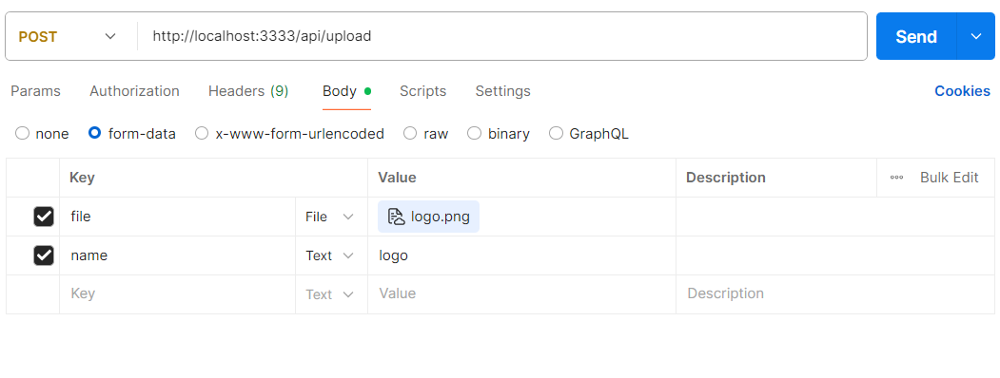

## Para iniciar esse projeto Minio com Docker compose

- É necessario ter o docker instalado e configurado na sua maquina.
- esse projeto foi feito em Node.js com javascript e typescript.
- caso queria criar apenas em javascript, achei um material muito bacana é todo em ingles mais da para ter uma base e clonar o repositorio.
  
Github: https://github.com/Developer-Nijat/MinIO-File-Management-Server-with-Node.JS

Youtube: https://youtu.be/EiWG9lJ_fIc?si=1EDC2XwKC_FDG4tV

## iniciando o projeto em minha maquina.

- Apos baixar o codigo ou clonar o projeto, (npm install) para baixar todas as dependencias do projeto.

## Observação

- no arquivo docker-compose.yml existe a versão do minio que foi instalada, por padrão ele sempre busca a ultima versão, que foi removida varias funcionalidades que antes era de graça no minio :( então mantenha a imagem nesta versão que inclui na (image).
  
 minio:
 
    image: minio/minio:RELEASE.2025-02-03T21-03-04Z-cpuv1

- Ao iniciar o container com docker-compose up --build se atente esse container starta seu container com a minio e também seu backend também então fique esperto! se tiver startado seu backend antes ao tentar enviar o arquivo vai dizer que a porta 3333 esta em uso, então pode modificar o docker ou parar a execusão e iniciar utilizando o comando do docker, mostrado acima.

- ao iniciar o container vai poder acessar o painel do Minio API http://127.0.0.1:9000  
- acessando o painel, no seu arquivo docker-compose.yml aqui pode redefinir a senha para acessar.

environment:

      MINIO_ROOT_USER: test@mt2024
  
      MINIO_ROOT_PASSWORD: test@mt2024

- no seu terminal vai aparecer os containers que pode ser acessado pelo seu navegador.
  
exemplo:

## Variaveis de ambiente

MINIO_BUCKET=uploads

MINIO_BUCKET=uploads aqui você coloca o mesmo nome que criou sua bucket lá no painel da minio.

- Opte por manter a sua bucket publica, como este projeto esta com uma versão anterior as modificações pela minio você pode fazer essa alteração.

## Como testar o upload do arquivo.

- você pode enviar as imagem utilizando o Postman que foi oque eu optei mais você pode usar o Insomnia fique avontade ou ate mesmo chamar por uma requisição do seu frontend para a rota do upload.
- Requisição tipo POST: http://localhost:3333/api/upload

- é necessario passar alguns dados no seu Body como file, name.
- file para abrir seu local e buscar a imagem.
- name, adiciona um nome na sua imagem salva no ambiente minio.
- veja um exemplo no postman dos dados necessario para enviar o arquivo.
  
exemplo:

## Codigo Aberto

- Gostaria de contribuir com esse repositorio?
- qualquer nova implementação que você fizer achar interresante compartilhe com migo, vou adorar analisar e implementar aqui no projeto, juntos chegaremos mais longe!!!!  :)
- crie uma branch local suba as alterações e comente sobre as alterações se possivel um pegueno comentario no codigo também, um abraço!

## Agradecimento

- Fique a vontade para me add nas redes ou me enviar uma mensagem, em como esse projeto impactou na sua aplicação ou nos seus estudos, o objetivo deu disponibilizar esse codigo foi a necessidade como alguns dos materiais que consumi não disponibilizava o codigo e nem mostrava o passo a passo da configuração resolvi disponibilizar esse aqui que estou implementando e melhorando também estou estudando e aprendendo novas tecnologias vamos junto nessa viagem?
  
- no meu Proflie tem o link das minhas redes sociais. 
